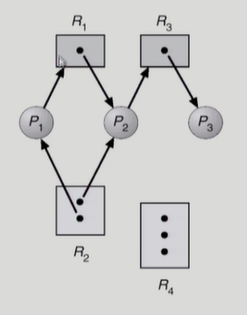
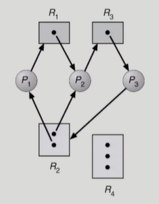
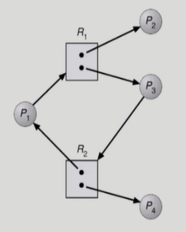

### Deadlock (교착상태)

- deadlock
  
  - 일련의 프로세스들이 서로가 가진 자원을 기다리며 block된 상태
  
  - resource (자원)
    
    - 하드웨어, 소프트웨어 등을 포함하는 개념
    
    - I/O device, CPU cycle, memory space, semaphore 등
    
    - 프로세스가 자원을 사용하는 절차
      
      - request, allocate, use, release

- deadlock 발생의 4가지 조건
  
  - mutual exclusion (상호배제)
    
    - 매 순간 하나의 프로세스만이 자원을 사용할 수 있음
  
  - no preemption (비선점)
    
    - 프로세스는 자원을 스스로 내어놓을 뿐 강제로 빼앗기지 않음
  
  - hold and wait (보유대기)
    
    - 자원을 가진 프로세스가 다른 자원을 기다릴 때 보유 자원을 놓지 않고 계속 가지고 있음
  
  - circular wait (순환대기)
    
    - 자원을 기다리는 프로세스 간 사이클이 형성되어야 함

- resource-allocation graph (자원할당그래프)
  
  - deadlock이 발생했는지 확인하기 위한 그래프
    
    - deadlock 확인 여부
      
      - 그래프에 cycle이 없으면 deadlock 아님
      
      - 그래프에 cycle이 있으면
        
        - if only one instance per resource type, then deadlock
        
        - if several instances per resource type, possibility of deadlock
    
    - 예시
      
      
      
      - P1 (프로세스)
        
        - 2번 자원을 가지고 있으면서 1번 자원을 기다리고 있음
        
        - 1번 자원 (R1)은 P2가 가지고 있음
          
          - P2는 1번 자원, 2번 자원을 가지고 있으면서 3번 자원을 기다리고 있음
            
            - 3번 자원은 P3가 가지고 있음
            
            - cycle이 없으므로 deadlock 아님
      
      
      
      - R2의 인스턴스가 2개이지만 더 이상 진행이 불가능
        
        - deadlock
      
      
    
    - 각 자원의 인스턴스를 모두 사용하고 cycle이 있지만 프로세스 2와 프로세스 4가 자원을 반납하면 해결

- deadlock의 처리 방법
  
  - deadlock이 생기지 않도록 미연에 방지하는 방법
    
    - deadlock prevention
      
      - 자원 할당 시 deadlock의 4가지 필요 조건 중 어느 하나가 만족되지 않도록 하는 것
    
    - deadlock avoidance
      
      - 자원 요청에 대한 부가적인 정보를 이용해서 deadlock의 가능성이 없는 경우에만 자원 할당
      
      - 시스템 state가 원래 state로 돌아올 수 있는 경우에만 자원 할당
  
  - deadlock이 생기도록 놓아두는 방법
    
    - deadlock detection and recovery
      
      - deadlock 발생은 허용하되 그에 대한 detection 루틴을 두어 deadlock 발견 시  recover
    
    - deadlock ignorance
      
      - deadlock을 시스템이 책임지지 않음
      
      - UNIX를 포함한 대부분의 OS가 채택하는 방법

- deadlock prevention
  
  - 자원 할당 시 deadlock의 4가지 필요 조건 중 어느 하나가 만족되지 않도록 하는 것
  
  - mutual exclusion
    
    - 공유해서는 안되는 자원의 경우 반드시 성립해야 함
  
  - hold and wait
    
    - 프로세스가 자원을 요청할 때 다른 어떤 자원도 가지고 있지 않아야 함
    
    - 방법1
      
      - **프로세스 시작 시** 모든 필요한 자원을 할당받게 하는 방법
      
      - 비효율적
    
    - 방법2
      
      - **자원이 필요할 경우** 보유 자원을 모두 놓고 다시 요청
  
  - no preemption
    
    - process가 어떤 자원을 기다려야 하는 경우 이미 보유한 자원이 선점됨
    
    - 모든 필요한 자원을 얻을 수 있을 때 그 프로세스는 다시 시작됨
    
    - state를 쉽게 save하고 restore할 수 있는 자원에서 주로 사용 (CPU, memory)
  
  - circular wait
    
    - 모든 자원 유형에 할당 순서를 정하여 정해진 순서대로만 자원 할당
  
  - utilization 저하, throughput 감소, starvation 문제

- deadlock avoidance
  
  - deadlock avoidance
    
    - 자원 요청에 대한 부가적인 정보를 이용해서 deadlock의 가능성이 없는 경우에만 자원 할당
    
    - 시스템 state가 원래 state로 돌아올 수 있는 경우에만 자원 할당
    
    - 가장 단순하고 일반적인 모델은 프로세스가 필요로 하는 각 자원별 최대 사용량을 미리 선언하도록 하는 방법
  
  - 2가지 알고리즘
    
    - 자원에 하나의 인스턴스만 있는 경우
      
      - Resource Allocation Graph Algorithm 사용
    
    - 자원에 여러 개의 인스턴스가 있는 경우
      
      - Banker's Algorithm 사용
        
        - 가정
          
          - 모든 프로세스는 자원의 최대 사용량을 미리 명시
          
          - 프로세스가 요청 자원을 모두 할당받은 경우 유한 시간 안에 자원을 다시 반납
        
        - 방법
          
          - 자원 요청 시 safe 상태를 유지할 경우에만 할당
          
          - 총 요청 자원의 수가 가용 자원의 수보다 적은 프로세스를 선택
            
            - 그런 프로세스가 없으면 unsafe 상태임
          
          - 그런 프로세스가 있으면 그 프로세스에게 자원 할당
          
          - 할당받은 프로세스가 종료되면 모든 자원을 반납
          
          - 모든 프로세스가 종료될 때까지 이러한 과정 반복

- deadlock detection and recovery

- deadlock ignorance