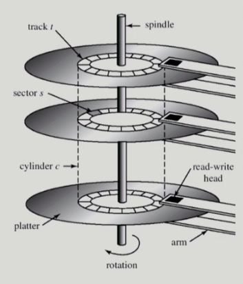

### Disk Management and Scheduling

- Disk Structure
  
  - logical block
    
    - 디스크의 외부에서 보는 디스크의 단위 정보 저장 공간들
    
    - 주소를 가진 1차원 배열처럼 취급
    
    - 정보를 전송하는 최소 단위
  
  - sector
    
    - logical block이 물리적인 디스크에 매핑된 위치
    
    - sector 0은 최외곽 실린더의 첫 트랙에 있는 첫 번째 섹터

- Disk Management
  
  - physical formatting (low-level formatting)
    
    - 디스크를 컨트롤러가 읽고 쓸 수 있도록 섹터들로 나누는 과정
    
    - 각 섹터는 header + 실제 data (보통 512 bytes) + trailer로 구성
    
    - header와 trailer는 sector number, ECC (Error-Correcting Code) 등의 정보가 저장되며 controller가 직접 접근 및 운영
  
  - partitioning
    
    - 디스크를 하나 이상의 실린더 그룹으로 나누는 과정
    
    - OS는 이것을 독립적 disk로 취급 (logical disk)
  
  - logical formatting
    
    - 파일 시스템을 만드는 것
    
    - FAT, inode, free space 등의 구조 포함
  
  - booting
    
    - ROM에 있는 small bootstrap loader의 실행
    
    - sector 0 (boot block)을 load하여 실행
    
    - sector 0은 full bootstrap loader program
    
    - OS를 디스크에서 load하여 실행

- Disk Scheduling
  
  - disk scheduling
    
    - access time의 구성
      
      - seek time
        
        - 헤드를 해당 실린더로 움직이는데 걸리는 시간
      
      - rotational latency
        
        - 헤드가 원하는 섹터에 도달하기까지 걸리는 회전지연시간
        
        - seek time의 1/10 정도
      
      - transfer time
        
        - 실제 데이터의 전송 시간
    
    - disk bandwidth
      
      - 단위 시간 당 전송된 바이트의 수
    
    - disk scheduling
      
      - seek time을 최소화하는 것이 목표
      
      - seek time ~= seek distance
  
  - disk scheduling algorithm
    
    - FCFS (First Come First Served)
      
      - 들어온 순서대로 처리
      
      - 비효율적
    
    - SSTF (Shortest Seek Time First)
      
      - 현재 헤드 위치에서 제일 가까운 요청을 가장 먼저 처리
      
      - starvation 문제
    
    - SCAN
      
      - disk arm이 디스크의 한쪽 끝에서 다른쪽 끝으로 이동하며 가는 길목에 있는 모든 요청 처리
      
      - 다른 한쪽 끝에 도달하면 역방향으로 이동하며 오는 길목에 있는 모든 요청을 처리하며 다시 반대쪽 끝으로 이동
      
      - 실린더 위치에 따라 대기 시간이 다름
        
        - 가운데 부분이 양 끝부분보다 대기 시간이 짧음
    
    - C-SCAN (Circular SCAN)
      
      - 헤드가 한쪽 끝에서 다른쪽 끝으로 이동하며 가는 길목에 있는 모든 요청을 처리
      
      - 다른쪽 끝에 도달했으면 요청을 처리하지 않고 곧바로 출발점으로 다시 이동
      
      - SCAN과 비교했을 때 이동거리는 길어지지만 균일한 대기 시간 제공
    
    - N-SCAN
      
      - SCAN의 변형 알고리즘
      
      - 일단 arm이 한 방향으로 움직이기 시작하면 그 시점 이후에 도착한 job은 되돌아올 때 service
    
    - LOOK
      
      - SCAN과 진행방향은 같음
      
      - 헤드가 진행 중이다가 그 방향에 더 이상 기다리는 요청이 없으면 헤드의 이동방향을 즉시 반대로 이동
    
    - C-LOOK
      
      - C-SCAN과 진행방향은 같음
      
      - 헤드가 진행 중이다가 그 방향에 더 이상 기다리는 요청이 없으면 헤드의 이동방향을 즉시 반대로 이동
  
  - disk scheduling algorithm의 결정
    
    - SCAN, C-SCAN 및 그 응용 알고리즘은 LOOK, C-LOOK 등이 일반적으로 디스크 입출력이 많은 시스템에서 효율적인 것으로 알려져 있음
    
    - file의 할당 방법에 따라 디스크 요청이 영향을 받음
    
    - 디스크 스케줄링 알고리즘은 필요할 경우 다른 알고리즘으로 쉽게 교체할 수 있도록 OS와 별도의 모듈로 작성되는 것이 바람직

- Swap-space management
  
  - disk를 사용하는 이유
    
    - memory의 휘발성
      
      - file system과 같이 영속적으로 데이터를 유지해야 하는 경우 비휘발성인 디스크 사용
    
    - 프로그램 실행을 위한 memory 공간 부족
      
      - swap area
  
  - swap space (=swap area)
    
    - virtual memory system에서 디스크를 memory의 연장 공간으로 사용
    
    - 파일시스템 내부에 둘 수도 있으나 별도 partition 사용이 일반적
      
      - 공간 효율성보다는 속도 효율성이 우선
        
        - 프로세스가 끝나면 없어질 내용이기 때문
      
      - 일반 파일보다 훨씬 짧은 시간만 존재하고 자주 참조됨
      
      - block의 크기 및 저장 방식이 일반 파일시스템과 다름

- RAID (Redundant Array of Independent Disks)
  
  - 여러 개의 디스크를 묶어서 사용
  
  - 목적
    
    - 디스크 처리 속도 향상
      
      - 여러 디스크에 block의 내용을 분산 저장
      
      - 병렬적으로 읽어옴 (interleaving, striping)
    
    - 신뢰성(Reliability) 향상
      
      - 동일 정보를 여러 디스크에 중복 저장
      
      - 하나의 디스크가 고장(failure) 시 다른 디스크에서 읽어옴 (mirroring, shadowing)
      
      - 단순한 중복 저장이 아니라 일부 디스크에 parity를 저장하여 공간의 효율성을 높임