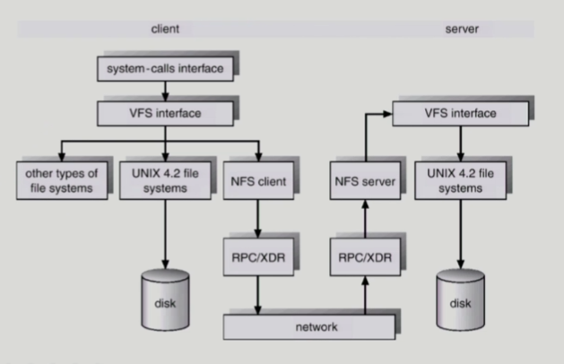
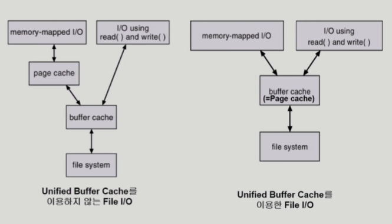

### File System Implementation

- Allocation of File Data in Disk
  
  - Contiguous Allocation
    
    - 하나의 파일이 디스크 상에 연속해서 저장되는 방법
      
      
    
    - 장점
      
      - fast I/O
        
        - 한번의 seek/rotation으로 많은 바이트 transfer
        
        - Realtime file 용 또는 이미 run 중이던 process의 swapping 용
      
      - direct access (=random access) 가능
    
    - 단점
      
      - external fragmentation
      
      - file grow가 어려움
        
        - 파일 크기가 커지는 데에 제약이 있음
        
        - file 생성시 얼마나 큰 hole을 배당할 것인가의 문제
        
        - grow 가능 vs 낭비 (internal fragmentation)
  
  - Linked Allocation
    
    - 파일의 데이터를 디스크의 빈 공간에 들어갈 수 있도록 하는 방법
      
      
    
    - 장점
      
      - external fragmentation 발생하지 않음
    
    - 단점
      
      - no random access
      
      - reliability 문제
        
        - 한 sector가 고장나 pointer가 유실되면 많은 부분을 잃음
      
      - pointer를 위한 공간이 block의 일부가 되어 공간 효율성을 떨어뜨림
        
        - 512 bytes/sector, 4bytes/pointer
    
    - 변형
      
      - FAT (File Allocation Table)
        
        - MS-DOS와 OS/2에서 사용
  
  - Indexed Allocation
    
    - 디렉토리에 파일의 위치를 바로 저장하는 것이 아니라 index를 가리키게 하고 index block 안에 위치 정보 전체를 저장하는 방법
      
      
    
    - 장점
      
      - external fragmentation 발생하지 않음
      
      - direct access 가능
    
    - 단점
      
      - 작은 용량인 파일의 경우 공간 낭비
        
        - 실제로 많은 파일은 작음
      
      - 너무 큰 파일은 하나의 block으로 index를 저장하기에 부족함
        
        - 해결 방안
          
          - linked scheme
            
            - index block에 위치 정보를 다 저장하지 못하는 경우 마지막에 새로운 위치 정보를 담고 있는 index 번호를 저장
          
          - multi-level index
            
            - index block에 위치 정보를 바로 저장하는 것이 아니고 새로운 index block의 위치를 저장하고 해당 index block에 실질적인 위치 정보를 저장 (그 이상의 단계를 거칠 수도 있음)
            
            - 단점
              
              - index를 위한 공간 낭비 발생
  
  - Free-Space Management
    
    - bit map or bit vector
      
      - bit[i]가 0이면 free, 1이면 occupied
      
      - 부가적인 공간을 필요로 함
      
      - 연속적인 n개의 free block을 찾는데 효과적
    
    - linked list
      
      - 모든 free block을 링크로 연결 (free list)
      
      - 연속적인 가용공간을 찾는 것은 쉽지 않음
      
      - 공간의 낭비가 없음
    
    - grouping
      
      - linked list 방법의 변형
      
      - 첫번째 free block이 n개의 pointer를 가짐
        
        - n-1 pointer는 free data block을 가리킴
        
        - 마지막 pointer가 가리키는 block은 또다시 n pointer를 가짐
    
    - counting
      
      - 프로그램이 종종 여러 개의 연속적인 block을 할당하고 반납한다는 성질에 착안
      
      - (first free block, # of contiguous free blocks)의 형태 유지

- 파일 시스템의 구조
  
  - UNIX 파일 시스템의 구조
    
    
    
    - 유닉스 파일 시스템의 중요 개념
      
      - Boot block
        
        - 모든 파일 시스템의 제일 앞에 옴
        
        - 부팅에 필요한 정보 (bootstrap loader)
          
          - 운영체제의 커널의 위치를 찾아 메모리에 올려 정상적인 부팅이 일어나게 됨
      
      - Super block
        
        - 파일 시스템에 관한 총체적인 정보를 담고 있음
        
        - 어디가 빈 블록이고 어디가 실제로 파일이 사용중인 블록인지, 어디까지가 Inode list이고 어디부터가 data block인지에 대한 정보 등
      
      - Inode list
        
        - 파일 이름을 제외한 파일의 모든 메타 데이터를 저장
      
      - Data block
        
        - 파일의 실제 내용을 보관
  
  - FAT 파일 시스템의 구조
    
    
    
    - 마이크로소프트사가 MS-DOS를 만들었을 때 처음 만든 파일 시스템
    
    - FAT 파일 시스템의 중요 개념
      
      - Boot block
        
        - 부팅에 필요한 정보
      
      - FAT
        
        - 파일의 메타데이터 중 일부(위치정보)를 보관
      
      - Root directory
      
      - Data block
        
        - 대부분의 메타데이터 보관
          
          - 파일의 이름을 비롯한 접근권한, 소유주, 파일의 사이즈, 해당 파일의 첫번째 위치 등

- Directory Implementation
  
  - linear list
    
    - `<file name, file의 metadata>`의 list
    
    - 구현이 간단함
    
    - 디렉토리 내에 파일이 있는지 찾기 위해서는 linear search가 필요함
      
      - 시간 소요
  
  - hash table
    
    - linear list + hashing
    
    - hash table은 file name을 이 파일의 linear list의 위치로 바꾸어줌
    
    - search time을 없앰
    
    - collision 발생 가능
  
  - file의 metadata의 보관 위치
    
    - 디렉토리 내에 직접 보관
    
    - 디렉토리에는 포인터를 두고 다른 곳에 보관
      
      - inode(UNIX 시스템), FAT(FAT 파일 시스템) 등
  
  - long file name의 지원
    
    - `<file name, file의 metadata>`의 list에서 각 entry는 일반적으로 고정 크기
    
    - file name이 고정 크기의 entry 길이보다 길어지는 경우 entry의 마지막 부분에 이름의 뒷부분이 위치한 곳의 **포인터**를 두는 방법
    
    - 이름의 나머지 부분은 동일한 directory file의 일부에 존재

- VFS and NFS
  
  
  
  - VFS (Virtual File System)
    
    - 서로 다른 다양한 file system에 대해 **동일한 시스템 콜 인터페이스(API)를 통해 접근**할 수 있게 해주는 OS의 layer
  
  - NFS (Network File System)
    
    - 분산 시스템에서는 네트워크를 통해 파일이 공유될 수 있음
    
    - NFS는 분산 환경에서의 대표적인 파일 공유 방법

- page cache와 buffer cache
  
  - page cache
    
    - virtual memory의 paging system에서 사용하는 page frame을 caching의 관점에서 설명하는 용어
    
    - memory-mapped I/O를 쓰는 경우 file의 I/O에서도 page cache 사용
      
      - memory-mapped I/O
        
        - file의 일부를 virtual memory에 mapping시킴
        
        - 매핑시킨 영역에 대한 메모리 접근 연산은 파일의 입출력을 수행하게 함
  
  - buffer cache
    
    - 파일시스템을 통한 I/O 연산은 메모리의 특정 영역인 buffer cache 사용
    
    - file 사용의 locality 활용
      
      - 한번 읽어온 block에 대한 후속 요청 시 buffer cache에서 즉시 전달
    
    - 모든 프로세스가 공용으로 사용
    
    - replacement algorithm (LRU, LFU 등) 필요
  
  - unified buffer cache
    
    
    
    - 최근 OS에서는 기존의 buffer cache가 page cache에 통합됨
    
    - buffer cache도 page 단위로 관리