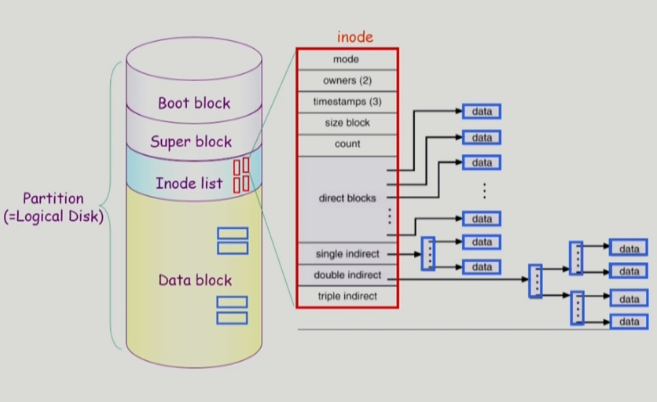

### File System Implementation

- Allocation of File Data in Disk
  
  - Contiguous Allocation
    
    - 하나의 파일이 디스크 상에 연속해서 저장되는 방법
      
      
    
    - 장점
      
      - fast I/O
        
        - 한번의 seek/rotation으로 많은 바이트 transfer
        
        - Realtime file 용 또는 이미 run 중이던 process의 swapping 용
      
      - direct access (=random access) 가능
    
    - 단점
      
      - external fragmentation
      
      - file grow가 어려움
        
        - 파일 크기가 커지는 데에 제약이 있음
        
        - file 생성시 얼마나 큰 hole을 배당할 것인가의 문제
        
        - grow 가능 vs 낭비 (internal fragmentation)
  
  - Linked Allocation
    
    - 파일의 데이터를 디스크의 빈 공간에 들어갈 수 있도록 하는 방법
      
      
    
    - 장점
      
      - external fragmentation 발생하지 않음
    
    - 단점
      
      - no random access
      
      - reliability 문제
        
        - 한 sector가 고장나 pointer가 유실되면 많은 부분을 잃음
      
      - pointer를 위한 공간이 block의 일부가 되어 공간 효율성을 떨어뜨림
        
        - 512 bytes/sector, 4bytes/pointer
    
    - 변형
      
      - FAT (File Allocation Table)
        
        - MS-DOS와 OS/2에서 사용
  
  - Indexed Allocation
    
    - 디렉토리에 파일의 위치를 바로 저장하는 것이 아니라 index를 가리키게 하고 index block 안에 위치 정보 전체를 저장하는 방법
      
      
    
    - 장점
      
      - external fragmentation 발생하지 않음
      
      - direct access 가능
    
    - 단점
      
      - 작은 용량인 파일의 경우 공간 낭비
        
        - 실제로 많은 파일은 작음
      
      - 너무 큰 파일은 하나의 block으로 index를 저장하기에 부족함
        
        - 해결 방안
          
          - linked scheme
            
            - index block에 위치 정보를 다 저장하지 못하는 경우 마지막에 새로운 위치 정보를 담고 있는 index 번호를 저장
          
          - multi-level index
            
            - index block에 위치 정보를 바로 저장하는 것이 아니고 새로운 index block의 위치를 저장하고 해당 index block에 실질적인 위치 정보를 저장 (그 이상의 단계를 거칠 수도 있음)
            
            - 단점
              
              - index를 위한 공간 낭비 발생

- UNIX 파일 시스템의 구조
  
  
  
  - 유닉스 파일 시스템의 중요 개념
    
    - Boot block
      
      - 모든 파일 시스템의 제일 앞에 옴
      
      - 부팅에 필요한 정보 (bootstrap loader)
        
        - 운영체제의 커널의 위치를 찾아 메모리에 올려 정상적인 부팅이 일어나게 됨
    
    - Super block
      
      - 파일 시스템에 관한 총체적인 정보를 담고 있음
      
      - 어디가 빈 블록이고 어디가 실제로 파일이 사용중인 블록인지, 어디까지가 Inode list이고 어디부터가 data block인지에 대한 정보 등
    
    - Inode list
      
      - 파일 이름을 제외한 파일의 모든 메타 데이터를 저장
    
    - Data block
      
      - 파일의 실제 내용을 보관

- FAT 파일 시스템의 구조
  
  
  
  - 마이크로소프트사가 MS-DOS를 만들었을 때 처음 만든 파일 시스템
  
  - FAT 파일 시스템의 중요 개념
    
    - Boot block
      
      - 부팅에 필요한 정보
    
    - FAT
      
      - 파일의 메타데이터 중 일부(위치정보)를 보관
    
    - Root directory
    
    - Data block
      
      - 대부분의 메타데이터 보관
        
        - 파일의 이름을 비롯한 접근권한, 소유주, 파일의 사이즈, 해당 파일의 첫번째 위치 등