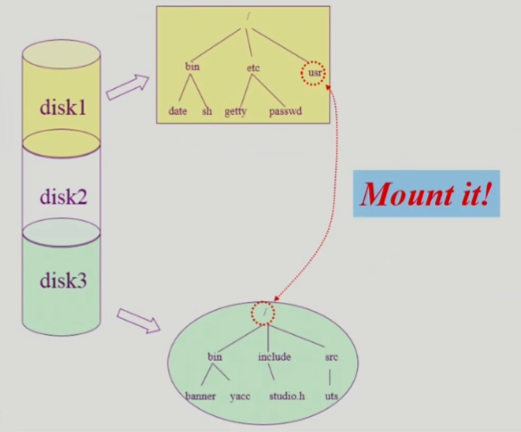

### File Systems

- File and File System
  
  - File
    
    - A named collection of related information
    
    - 일반적으로 비휘발성의 보조기억장치에 저장
    
    - 운영체제는 다양한 저장 장치를 file이라는 동일한 논리적 단위로 볼 수 있게 해 줌
    
    - operation
      
      - create, read, write, reposition (lseek), delete, open, close 등
  
  - File attribute (혹은 파일의 metadata)
    
    - 파일 자체의 내용이 아니라 파일을 관리하기 위한 각종 정보들
      
      - 파일 이름, 유형, 저장된 위치, 파일 사이즈
      
      - 접근 권한 (읽기/쓰기/실행), 시간 (생성/변경/사용), 소유자 등
  
  - File System
    
    - 운영체제에서 파일을 관리하는 부분
    
    - 파일 및 파일의 메타데이터, 디렉토리 정보 등을 관리
    
    - 파일의 저장 방법 결정
    
    - 파일 보호 등

- Directory and Logical Disk
  
  - Directory
    
    - 파일의 메타데이터 중 일부를 보관하고 있는 일종의 특별한 파일
    
    - 그 디렉토리에 속한 파일 이름 및 파일 attribute를 포함하는 의미
    
    - operation
      
      - search for a file, create a file, delete a file
      
      - list a directory, rename a file, traverse the file system
  
  - Partition (=Logical Disk)
    
    - 하나의 (물리적) 디스크 안에 여러 파티션을 두는 것이 일반적
    
    - 여러 개의 물리적인 디스크를 하나의 파티션으로 구성하기도 함
    
    - (물리적) 디스크를 파티션으로 구성한 뒤 각각의 파티션에 file system을 깔거나 swapping 등 다른 용도로 사용할 수 있음

- open()
  
  - **파일의 metadata를 메모리에 올려놓는 것**
  
  - retrieves metadata from disk to main memory
  
  - `open("/a/b/c")`
    
    - 디스크로부터 파일 c의 메타데이터를 메모리로 가지고 옴
    
    - 이를 위해서 directory path를 search
      
      - 루트 디렉토리 `/` 를 open하고 그 안에서 파일 a의 위치 획득
      
      - 파일 a를 open한 후 read하여 그 안에서 파일 b의 위치 획득
      
      - 파일 b를 open한 후 read하여 그 안에서 파일 c의 위치 획득
      
      - 파일 c를 open
    
    - directory path의 search에 너무 많은 시간 소요
      
      - open을 read/write와 별도로 두는 이유임
      
      - 한 번 open한 파일은 read/write 시 directory search 불필요
    
    - open file table
      
      - 현재 open된 파일의 메타데이터 보관소 (in memory)
      
      - 디스크의 메타데이터보다 몇 가지 정보가 추가됨
        
        - open한 프로세스의 수
        
        - file offset
          
          - 파일이 어느 위치에 접근 중인지 (별도의 테이블이 필요함)
    
    - file descriptor (file handle, file control block)
      
      - open file table에 대한 위치 정보 (프로세스 별)

- File Protection
  
  - 각 파일에 대해 누구에게 어떤 유형의 접근 (read/write/execution)을 허락할 것인가?
  
  - access control 방법
    
    - access control matrix
      
      |       | file1 | file2 | file3 |
      | ----- | ----- | ----- | ----- |
      | user1 | rw    | rw    | r     |
      | user2 | rw    | r     | r     |
      | user3 | r     |       |       |
      
      - access control list (ACL)
        
        - matrix에서 열에 해당하는 부분
        
        - 파일별로 누구에게 어떤 접근 권한이 있는지 표시
      
      - capability
        
        - matrix에서 행에 해당하는 부분
        
        - 사용자별로 자신이 접근 권한을 가진 파일 및 해당 권한 표시
      
      - 모든 사용자에 대해 모든 파일의 접근 권한을 제어
        
        - 부가적인 오버헤드가 큼
    
    - grouping
      
      - 전체 user를 owner, group, public의 세 그룹으로 구분
      
      - 각 파일에 대해 세 그룹의 접근 권한(rwx)을 3비트씩으로 표시
      
      - 일반적으로 이 방법 사용
      
      - 예시
        
        - UNIX
          
          - rwxr--r--
            
            - rwx(owner)r--(group)r--(other)
    
    - password
      
      - 파일마다 password를 두는 방법
        
        - 디렉토리 파일에 두는 방법도 가능
      
      - 모든 접근 권한에 대해 하나의 password
        
        - all-or-nothing
      
      - 접근 권한별 password
        
        - 암기 문제, 관리 문제

- file system의 mounting
  
  
  
  - 하나의 물리적인 disk를 파티셔닝을 통해 여러 개의 논리적인 디스크로 나눌 수 있음
  
  - 각각의 논리적인 디스크에는 파일 시스템을 설치해 사용할 수 있음
  
  - 특정 운영체제에 대해서 파일 시스템 하나가 접근 가능한데 만약 다른 파티션에 설치되어 있는 파일 시스템에 접근해야 한다면 **mounting 연산 이용**
    
    - root file system의 특정 디렉토리에 또 다른 파티션에 있는 파일 시스템을 마운트
      
      - 마운트된 디렉토리를 접근하게 되면 또 다른 파티션에 있는 파일 시스템에 접근하는 것과 동일

- access methods
  
  - 시스템이 제공하는 파일 정보의 접근 방식
    
    - 순차 접근 (sequential access)
      
      - 카세트 테이프를 사용하는 방식처럼 접근
      
      - 읽거나 쓰면 offset은 자동적으로 증가
    
    - 직접 접근, 임의 접근 (direct access, random access)
      
      - LP 레코드 판과 같이 접근하도록 함
      
      - 파일을 구성하는 레코드를 임의의 순서로 접근할 수 있음