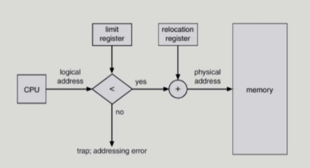
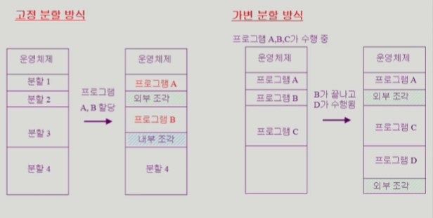
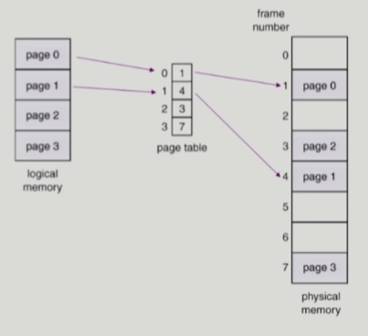
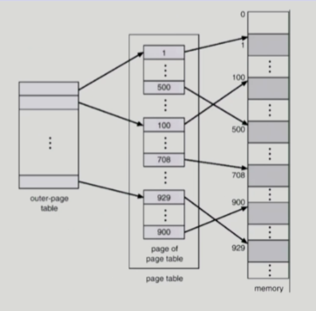

### Memory Management

- 메모리 주소
  
  - 메모리는 주소를 통해 접근
  
  - Logical Address vs Physical Address
    
    - Logical Address (논리 주소 = Virtual Address, 가상 주소)
      
      - 프로세스마다 독립적으로 가지는 주소 공간
      
      - 각 프로세스마다 0번부터 시작
      
      - **CPU가 보는 주소는 logical address**
    
    - Physical Address (물리 주소)
      
      - 메모리에 실제 올라가는 위치
  
  - 주소 바인딩 (Address Binding)
    
    - 주소를 결정하는 것
      
      - Symbolic Address -> Logical Address ---(이 시점)--->  Physical Address
    
    - Compile time binding
      
      - 물리적 메모리 주소 (physical address)가 컴파일 시 알려짐
        
        - 논리 주소가 물리 주소
        
        - 그렇기 때문에 다른 주소가 비어있어도 항상 0번부터 시작
          
          - 비효율적
      
      - 시작 위치 변경 시 재컴파일해야 함
      
      - 컴파일러는 절대 코드 (absolute code) 생성
    
    - Load time binding
      
      - 실행이 시작될 때 주소 변환이 이루어짐
        
        - = 메모리에 올라갈 때
      
      - Loader의 책임 하에 물리적 메모리 주소 부여
      
      - 컴파일러가 재배치가능코드 (relocatable code)를 생성한 경우 가능
    
    - Execution time binding (=Run time binding)
      
      - 수행이 시작된 이후에도 프로세스의 메모리 상 위치를 옮길 수 있음
      
      - CPU가 주소를 참조할 때마다 binding을 점검 (address mapping table)
      
      - 하드웨어적인 지원 필요 (base and limit registers, MMU)
        
        - MMU (Memory-Management Unit)
          
          - logical address를 physical address로 매핑해주는 **하드웨어** device
          
          - scheme
            
            
            
            - 사용자 프로세스가 CPU에서 수행되며 생성해내는 모든 주소 값에 대해
            
            - limit register를 확인해 범위 내에 있으면 base register (relocation register)의 값을 logical address 값에 더함
              
              - limit register
                
                - 논리적 주소의 범위
                
                - 범위 내에 없으면 addressing error
              
              - relocation register
                
                - 접근할 수 있는 물리적 메모리 주소의 최소값

- 용어
  
  - dynamic loading
    
    - 프로세스 전체를 메모리에 미리 다 올리는 것이 아니라 해당 루틴이 불려질 때 메모리에 load하는 것
      
      - loading
        
        - 메모리로 올리는 것
    
    - memory utilization의 향상
    
    - 가끔씩 사용되는 많은 양의 코드의 경우 유용
      
      - 오류 처리 루틴 등
    
    - 운영체제의 특별한 지원 없이 프로그램 자체에서 구현 가능 (OS는 라이브러리를 통해 지원 가능)
  
  - dynamic linking
    
    - linking을 실행 시간 (execution time)까지 미루는 기법
    
    - static linking과 dynamic linking
      
      - static linking
        
        - 라이브러리가 프로그램의 실행 파일 코드에 포함
        
        - 실행 파일의 크기가 커짐
        
        - 동일한 라이브러리를 각각의 프로세스가 메모리에 올리므로 메모리 낭비 (prinf 함수의 라이브러리 코드와 같이 여러 번 사용되는 경우)
      
      - dynamic linking
        
        - 라이브러리가 실행 시 연결됨
        
        - 라이브러리 호출 부분에 라이브러리 루틴의 위치를 찾기 위한 stub이라는 작은 코드를 둠
        
        - 라이브러리가 이미 메모리에 있으면 그 루틴의 주소로 가고 없으면 디스크에서 읽어옴
        
        - 운영체제의 도움이 필요
  
  - overlays
    
    - 메모리에 프로세스의 부분 중 실제 필요한 정보만을 올림
    
    - 프로세스의 크기가 메모리보다 클 때 유용
    
    - 운영체제의 지원없이 사용자에 의해 구현
    
    - 작은 공간의 메모리를 사용하던 초창기 시스템에서 **수작업으로 프로그래머가 구현**
      
      - Manual Overlay
      
      - 프로그래밍이 매우 복잡
  
  - swapping
    
    - 프로세스를 일시적으로 메모리에서 backing store로 쫓아내는 것
      
      - backing store (swap area)
        
        - 디스크
          
          - 많은 사용자의 프로세스 이미지를 담을만큼 충분히 빠르고 큰 저장 공간
    
    - swap in / swap out
      
      - 일반적으로 중기 스케줄러 (swapper)에 의해 swap out 시킬 프로세스 선정
      
      - priority-based CPU scheduling algorithm
        
        - priority가 낮은 프로세스를 swapped out 시킴
        
        - priority가 높은 프로세스를 메모리에 올려놓음
      
      - compile time 혹은 load time binding에서는 원래 메모리 위치로 swap in 해야하기 때문에 큰 효과 못느낄 수도 있음
      
      - execution time binding에서는 추후 빈 메모리 영역 아무 곳에나 올릴 수 있음
      
      - swap time은 대부분 transfer time (swap되는 양에 비례하는 시간)임

- 물리 메모리 할당 (Allocation of Physical Memory)
  
  - 메모리는 일반적으로 두 영역으로 나뉘어 사용
    
    - OS 상주 영역
      
      - interrupt vector와 함께 낮은 주소 영역 사용
    
    - 사용자 프로세스 영역
      
      - 높은 주소 영역 사용
      
      - 사용자 프로세스 영역의 할당 방법
        
        - **Contiguous allocation**
          
          - 각각의 프로세스가 메모리의 연속적인 공간에 적재되도록 하는 것
          
          - Fixed partition allocation
          
          - Variable partition allocation
        
        - **Noncontiguous allocation**
          
          - 하나의 프로세스가 메모리의 여러 영역에 분산되어 올라갈 수 있음
          
          - Paging
          
          - Segmentation
          
          - Paged Segmentation
  
  - Contiguous Allocation
    
    
    
    - 고정분할 (Fixed partition) 방식
      
      - 물리적 메모리를 몇 개의 영구적 분할 (partition)로 나눔
      
      - 분할의 크기가 모두 동일한 방식과 서로 다른 방식이 존재
      
      - 분할 당 하나의 프로그램 적재
      
      - 융통성이 없음
        
        - 동시에 메모리에 load되는 프로그램의 수가 고정됨
        
        - 최대 수행 가능 프로그램 크기 제한
      
      - internal fragmentation 발생 (external fragmentation도 발생)
        
        - internal fragmentation (내부 조각)
          
          - 프로그램 크기보다 분할의 크기가 큰 경우
          
          - 하나의 분할 내부에서 발생하는 사용되지 않는 메모리 조각
          
          - 특정 프로그램에 배정되었지만 사용되지 않는 공간
    
    - 가변분할 (Variable partition) 방식
      
      - 프로그램의 크기를 고려해서 할당
      
      - 분할의 크기, 개수가 동적으로 변함
      
      - 기술적 관리 기법 필요
      
      - external fragmentation 발생 (internal fragmentation은 발생하지 않음)
        
        - external fragmentation (외부 조각)
          
          - 프로그램 크기보다 분할의 크기가 작은 경우
          
          - 아무 프로그램에도 배정되지 않은 빈 곳인데도 프로그램이 올라갈 수 없는 작은 분할
      
      - hole
        
        - 가용 메모리 공간
        
        - 다양한 크기의 hole이 메모리 여러 곳에 흩어져 있음
        
        - 프로세스가 도착하면 수용가능한 hole을 할당
        
        - 운영체제의 다음의 정보를 유지
          
          - 할당 공간
          
          - 가용 공간 (hole)
        
        - Dynamic Storage-Allocation Problem
          
          - 가변 분할 방식에서 size n인 요청을 만족하는 가장 적절한 hole을 찾는 문제
          
          - `First-fit`
            
            - Size가 n 이상인 것 중 최초로 찾아지는 hole에 할당
          
          - `Best-fit`
            
            - Size가 n 이상인 가장 작은 hole을 찾아서 할당
            
            - hole의 리스트가 크기 순으로 정렬되지 않은 경우 모든 hole의 리스트를 탐색해야 함
            
            - 많은 수의 아주 작은 hole이 생성됨
          
          - `Worst-fit`
            
            - 가장 큰 hole에 할당
            
            - 모든 리스트를 탐색해야 함
            
            - 상대적으로 아주 큰 hole이 생성됨
          
          - First-fit과 Best-fit이 Worst-fit보다 속도와 공간 이용률 측면에서 효과적인 것으로 실험적인 결과 알려짐
        
        - compaction
          
          - external fragmentation 문제를 해결하는 한 가지 방법
          
          - 사용 중인 메모리 영역을 한 군데로 몰고 hole을 다른 한 곳으로 몰아 큰 block을 만드는 것
          
          - 비용이 매우 많이 듦
            
            - 최소한의 메모리 이동으로 compaction하는 방법은 매우 복잡한 문제
          
          - compaction은 프로세스의 주소가 실행 시간에 동적으로 재배치 가능한 경우에만 수행될 수 있음
  
  - Noncontiguous allocation
    
    - Paging
      
      - paging
        
        - Process의 virtual memory를 동일한 사이즈의 page 단위로 나눔
        
        - virtual memory의 내용이 페이지 단위로 noncontiguous하게 저장
        
        - 일부는 backing storage에, 일부는 physical memory에 저장
      
      - 방법
        
        
        
        - physical memory를 동일한 크기의 프레임으로 나눔
        
        - logical memory를 frame과 같은 크기의 페이지로 나눔
        
        - 모든 가용 프레임 관리
        
        - page table을 사용하여 logical address를 physcial address로 변환
        
        - external fragmentation은 발생하지 않음
        
        - internal fragmentation 발생 가능
      
      - implementation
        
        - page table은 main memory에 상주
        
        - 2개의 register
          
          - page-table base register (PTBR)
            
            - page table을 가리킴
          
          - page-table length register (PTLR)
            
            - 테이블 크기를 보관
        
        - 모든 메모리 접근 연산에는 2번의 memory access 필요
          
          - page table 접근 1번, 실제 data/instruction 접근 1번
        
        - 속도 향상을 위해 associative register 혹은 translation look-aside buffer (TLB)라 불리는 고속의 lookup hardware cache 사용
          
          - associative register (TLB)
            
            - parallel search 가능
            
            - TLB에는 page table 중 일부만 존재
            
            - address translation 방법
              
              - page table 중 일부가 associative register에 보관되어 있음
              
              - 만약 해당 page 번호가 associative register에 있는 경우 바로 frame 번호를 얻음
              
              - 그렇지 않은 경우 main memory의 page table로부터 frame 번호 얻음
              
              - TLB는 context switch 때 flush (remove old entries)
            
            - 메모리 접근 시간 (Access Time)
              
              - associative register lookup time : ε
              
              - memory cycle time : 1
              
              - hit ratio : α
                
                - associative register에서 찾아지는 비율
                
                - 1에 가까운 수임
              
              - Effective Access Time (EAT)
                
                - EAT = hit + miss
                
                - EAT = `((실제 데이터에 접근하는 메모리 접근 시간 + TLB에 접근하는 시간) * TLB에서 주소변환 정보가 찾아지는 비율)` + `((페이지 테이블 접근 시간 + 실제 데이터 접근 시간 + TLB에 접근하는 시간) * 주소변환 정보가 TLB에 없는 경우)`
                
                - EAT = (1+ε)α + ((2+ε)(1-α))
                
                - EAT = 2 + ε - α
                  
                  - α가 1에 가까운 수이므로 ε은 작은 수이고 결과적으로 2 + ε - α는 페이지 테이블만 있을 때의 2보다 작은 수
      
      - Two-Level Page Table
        
        - 시간은 더 걸리지만 페이지 테이블을 위한 공간을 줄임
          
          - 현대의 컴퓨터는 address space가 매우 큰 프로그램 지원
            
            - 32 bit address 사용 시 2^32B (4GB)의 주소 공간
            
            - 각 page size가 4K인 경우 1M개의 page table entry 필요
            
            - 그러나, 대부분의 프로그램은 4G의 주소 공간 중 지극히 일부분만 사용하므로 page table공간이 심하게 낭비됨
          
          - page table 자체를 page로 구성하고 **사용되지 않는 주소 공간에 대한 outer page table의 엔트리 값은 NULL**
        
        - 예시
          
          
          
          - page table(위 그림의 가운데)의 크기와 memory의 크기는 동일함
          
          - logical address (on 32bit machine with 4K page size)의 구성
            
            | page number |     | page offset |
            | -----------:| ---:| -----------:|
            | p1          | p2  | d           |
            | 10          | 10  | 12          |
            
            - 20 bit의 page number
              
              - p1 : outer page table의 index
              
              - p2 : outer page table의 page에서의 변위 (displacement)
              
              - page table 자체가 page로 구성되기 때문에 p1과 p2는 각각 10 bit
            
            - 12 bit의 page offset
      
      - Multilevel Paging and Performance
        
        - Address space가 더 커지면 다단계 페이지 테이블 필요
        
        - 각 단계의 페이지 테이블이 메모리에 존재하므로 logical address의 physical address 변환에 더 많은 메모리 접근 필요
        
        - TLB를 통해 메모리 접근 시간을 줄일 수 있음
        
        - 예시
          
          - 4단계 페이지 테이블을 사용하고
          
          - 메모리 접근 시간이 100ns, TLB 접근 시간이 20ns이고
          
          - TLB hit ratio가 98%인 경우
            
            - effective memory access time = 0.98 * 120 + 0.02 * 520 = 128ns
            
            - 메모리 접근 시간이 100ns이므로 주소변환의 경우 28ns만 소요됨
    
    - Segmentation
    
    - Paged segmentation