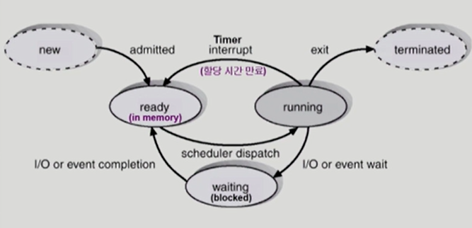
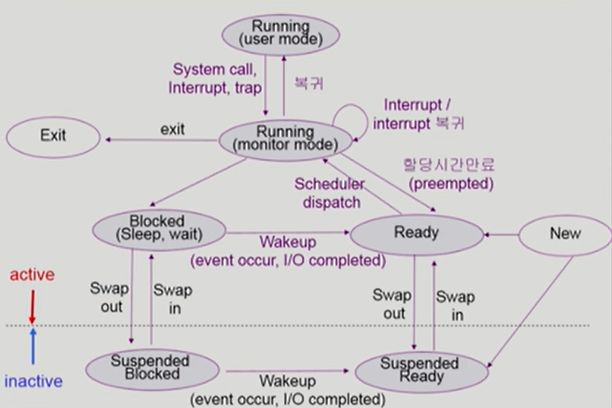

### 프로세스

- 개념
  
  - 실행중인 프로그램

- 문맥 (context)
  
  - cpu 수행 상태를 나타내는 하드웨어 문맥
    
    - program counter
    
    - 각종 register
  
  - 프로세스의 주소 공간
    
    - code, data, stack
  
  - 프로세스 관련 커널 자료 구조
    
    - PCB (Process Control Block)
    
    - Kernel stack

- 프로세스 상태 (Process State)
  
  
  
  - Running
    
    - cpu를 잡고 instruction을 수행중인 상태
  
  - Ready
    
    - cpu를 기다리는 상태 (메모리 등 다른 조건을 모두 만족하고)
  
  - Blocked (wait, sleep)
    
    - cpu를 주어도 당장 instruction을 수행할 수 없는 상태
    
    - process 자신이 요청한 이벤트 (I/O 등)가 즉시 만족되지 않아 이를 기다리는 상태
      
      - 디스크에서 파일을 읽어와야 하는 경우 등
  
  - New
    
    - 프로세스가 생성중인 상태
  
  - Terminated
    
    - 수행 (execution)이 끝난 상태
    
    - 끝나고 정리작업을 하는 상태
    
    - 완전히 끝나면 프로세스가 아니게 됨

- PCB (Process Control Block)
  
  - 운영체제가 각 프로세스를 관리하기 위해 프로세스당 유지하는 정보
  
  - 구성요소 - 구조체로 유지
    
    - OS가 관리상 사용하는 정보
      
      - Process State, Process ID
      
      - scheduling information, priority
    
    - CPU 수행 관련 하드웨어 값
      
      - Program counter, registers
    
    - 메모리 관련
      
      - code, data, stack의 위치 정보
    
    - 파일 관련
      
      - open file descriptors

- 문맥 교환 (Context Switch)
  
  - CPU를 한 프로세스에서 다른 프로세스로 넘겨주는 과정
  
  - CPU가 다른 프로세스에게 넘어갈 때 운영체제가 수행하는 일
    
    - CPU를 내어주는 프로세스의 상태를 그 프로세스의 PCB에 저장
    
    - CPU를 새롭게 얻는 프로세스의 상태를 PCB에서 읽어옴
  
  - system call이나 interrupt 발생 시 반드시 문맥 교환이 일어나는 것은 아님
    
    - 커널 모드를 거쳐 다른 프로세스로 CPU가 넘어가면 문맥 교환
    
    - 커널 모드를 거쳐 기존 프로세스로 돌아오면 문맥 교환이 아님

- 프로세스를 스케줄링하기 위한 큐
  
  - Job queue
    
    - 현재 시스템 내에 있는 모든 프로세스의 집합
    
    - Ready queue와 Device queues의 프로세스를 포함
  
  - Ready queue
    
    - 현재 메모리 내에 있으면서 CPU를 잡아서 실행되기를 기다리는 프로세스의 집합
  
  - Device queues
    
    - I/O device의 처리를 기다리는 프로세스의 집합

- 스케줄러 (scheduler)
  
  - long-term scheduler (job scheduler)
    
    - 시작 프로세스 중 어떤 것을 ready queue로 보낼지 결정
    
    - 프로세스에 메모리 및 각종 자원을 주는 문제
      
      - 프로세스의 상태 중 new에서 ready로 가는 문제
    
    - degree of multiprogramming 제어
      
      - 메모리에 올라가있는 프로세스의 수 제어
    
    - **time sharing system에는 보통 장기 스케줄러가 없음**
      
      - 무조건 ready
  
  - short-term scheduler (CPU scheduler)
    
    - 어떤 프로세스를 다음번에 running 시킬지 결정
    
    - 프로세스에 CPU를 주는 문제
    
    - millisecond 단위로 충분히 빨라야 함
  
  - medium-term scheduler (Swapper)
    
    - 여유 공간 마련을 위해 프로세스를 통째로 메모리에서 디스크로 쫓아냄
    
    - 프로세스에게서 메모리를 뺏는 문제
    
    - degree of multiprogramming 제어
    
    - 프로세스의 상태에 Suspended 상태가 추가

- 현대의 프로세스 상태 (Process State)
  
  
  
  - Running
    
    - cpu를 잡고 instruction을 수행중인 상태
  
  - Ready
    
    - cpu를 기다리는 상태 (메모리 등 다른 조건을 모두 만족하고)
  
  - Blocked (wait, sleep)
    
    - cpu를 주어도 당장 instruction을 수행할 수 없는 상태
    
    - process 자신이 요청한 이벤트 (I/O 등)가 즉시 만족되지 않아 이를 기다리는 상태
      
      - 디스크에서 파일을 읽어와야 하는 경우 등
    
    - **자신이 요청한 이벤트가 만족되면 Ready**
  
  - Suspended (stopped)
    
    - 외부적인 이유로 프로세스의 수행이 정지된 상태
    
    - 프로세스는 통째로 디스크에 swap out
    
    - 사용자가 프로그램을 일시정지시킨 경우에도 suspended 상태로 넘어감
      
      - 이 경우 프로그램을 재실행시키면 active
    
    - **외부에서 resume해 주어야 active 상태로 넘어감**

- Thread
  
  - 개념
    
    - 프로세스 내에서 실제로 작업을 수행하는 주체
    
    - 프로세스 하나에 cpu 수행단위를 여러 개 두고 있음
  
  - 구성
    
    - program counter
    
    - register set
    
    - stack space
  
  - 동료 thread와 공유하는 부분 (task)
    
    - code section
    
    - data section
    
    - OS resources
  
  - 장점
    
    - 다중 스레드로 구성된 태스크 구조에서는 하나의 서버 스레드가 blocked 상태인 동안에도 동일한 태스크 내의 다른 스레드가 running 상태가 되어 빠른 처리를 할 수 있음
    
    - 동일한 일을 수행하는 다중 스레드가 협력하여 높은 처리율 (throughput)과 성능 향상을 얻을 수 있음
    
    - 병렬성을 높일 수 있음