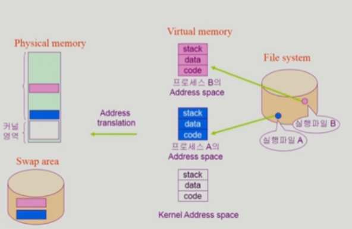

### 시스템 구조 (System Structure)

- Computer
  
  - CPU
    
    - 매 clock cycle마다 memory에서 instruction을 하나씩 가져와 실행
    
    - 매 실행이 끝나면 interrupt line을 확인
    
    - memory와 local buffer 모두에 접근할 수 있음
    
    - interrupt line
      
      - cpu는 항상 memory에 있는 instruction을 실행
      
      - I/O device에서의 입력이나 disk에서의 작업 완료 등을 전달
    
    - mode bit
      
      - cpu 안에 위치
      
      - cpu에서 실행되는 것이 운영체제인지 사용자 프로그램인지를 구분해줌
      
      - 0
        
        - 모니터모드, 커널모드, 시스템모드
          
          - OS 코드 수행
          
          - 메모리 접근, I/O device 접근 가능
        
        - interruption이나 exception 발생 시 하드웨어가 mode bit을 0으로 바꿈
      
      - 1
        
        - 사용자모드
          
          - 사용자 프로그램 수행
          
          - 제한된 instruction만 실행 가능
        
        - 사용자 프로그램에게 cpu를 넘기기 전에 mode bit을 1로 세팅
    
    - register
      
      - cpu 안에 위치
      
      - 정보를 저장하며 memory보다 빠르게 불러올 수 있음
  
  - memory
    
    - cpu의 작업공간

  - DMA (Direct Memory Access)
    
    - 빠른 입출력 장치를 메모리에 가까운 속도로 처리하기 위해 사용
    
    - cpu의 중재 없이 device controller가 device의 buffer storage의 내용을 메모리에 block 단위로 직접 전송
    
    - 바이트 단위가 아니라 block 단위로 인터럽트를 발생시킴
  
  - DMA controller (Direct Memory Access controller)
    
    - memory에 접근할 수 있는 장치
    
    - cpu와 동시에 특정 메모리 영역에 접근하는 경우 문제가 생길 수 있음
      
      - memory controller는 해당 부분을 중재하는 역할
    
    - 중간중간 들어오는 local buffer의 작업이 끝났으면 DMA controller가 해당 내용을 복사해줌
      
      - I/O 장치가 interrupt를 자주 걸게 되면 cpu가 너무 많은 방해를 받게 되기 때문
      
      - 해당 작업이 끝나면 cpu에 interrupt를 한 번만 걸어 cpu가 interrupt 받는 횟수를 줄일 수 있음
  
  - timer
    
    - computer에 존재하는 하드웨어
    
    - 특정 프로그램이 cpu를 독점하는 것을 막기 위함
    
    - memory에서 사용자 프로그램을 cpu에 넘겨줄 때 timer에 값을 세팅하여 넘겨주어 해당 시간이 지나면 cpu에 interrupt를 걸어줌
      
      - cpu가 interrupt를 확인하면 하던 일을 멈추고 cpu의 제어권이 사용자 프로그램에서 운영체제로 자동으로 넘어가게 됨
    
    - time sharing을 구현하기 위해 널리 이용됨
    
    - 현재 시간을 계산하기 위해서도 사용

- I/O device
  
  - disk
  
  - 키보드, 프린터, 모니터 등
  
  - 각각의 I/O device는 해당 device를 전담하는 작은 cpu인 device controller가 붙어있음
    
    - device controller
      
      - 해당 I/O 장치유형을 관리하는 일종의 작은 cpu
        
        - 하드웨어
      
      - 제어 정보를 위해 control register, status register을 가짐
    
    - local buffer
      
      - device controller의 작업공간
  
  - 예를 들어 키보드 입력을 받는다고 했으면 키보드 입력이 끝난 후 해당 정보가 local buffer에 담기고 device controller가 cpu에 interrupt를 걺
    
    - cpu 제어권이 운영체제로 넘어가면서 local buffer의 값을 해당 정보를 요청한 프로그램의 메모리 공간에 copy한 후 기존에 cpu 제어권을 갖고 있던 프로그램에 제어권이 다시 넘어감
  
  - 입출력의 수행
    
    - 모든 입출력 명령은 특권 명령
    
    - 사용자 프로그램은 어떻게 입출력을 하는가
      
      - 시스템콜 (system call)
        
        - 사용자 프로그램이 운영체제의 서비스를 받기 위해 커널 함수를 호출하는 것
      
      - trap을 사용하여 인터럽트 벡터의 특정 위치로 이동
        
        - interrupt (인터럽트)
          
          - 인터럽트 당한 시점의 레지스터와 program counter를 저장한 후 cpu의 제어를 인터럽트 처리 루틴에 넘김
          
          - interrupt (하드웨어 인터럽트)
            
            - 하드웨어가 발생시킨 인터럽트
          
          - trap (소프트웨어 인터럽트)
            
            - exception
              
              - 프로그램이 오류를 범한 경우
            
            - system call
              
              - 프로그램이 커널 함수를 호출하는 경우
          
          - 현대의 운영체제는 인터럽트에 의해 구동됨
          
          - 인터럽트 벡터
            
            - 해당 인터럽트의 처리 루틴 주소를 가지고 있음
          
          - 인터럽트 처리 루틴 (interrupt service routine)
            
            - 해당 인터럽트를 처리하는 커널 함수
      
      - 제어권이 인터럽트 벡터가 가리키는 인터럽트 서비스 루틴으로 이동
      
      - 올바른 I/O 요청인지 확인 후 I/O 수행
      
      - I/O 완료 시 제어권을 시스템콜 다음 명령으로 옮김

- 동기식 입출력과 비동기식 입출력
  
  - 동기식 입출력 (synchronous I/O)
    
    - I/O 요청 후 입출력 작업이 완료된 후에 제어가 사용자 프로그램에 넘어감
      
      - I/O는 커널을 통해서만 가능
    
    - 구현 1
      
      - I/O가 끝날 때까지 cpu 낭비
      
      - 매 시점 하나의 I/O만 일어날 수 있음
    
    - 구현 2
      
      - I/O가 완료될 때까지 해당 프로그램에게서 cpu를 빼앗음
      
      - I/O 처리를 기다리는 줄에 그 프로그램을 줄 세움
      
      - 다른 프로그램에 cpu를 줌
        
        - 여러 I/O장치를 사용할 수 있음
    
    - I/O의 완료는 인터럽트로 알려줌
  
  - 비동기식 입출력 (asynchronous I/O)
    
    - I/O가 시작된 후 입출력 작업이 끝나기를 기다리지 않고 제어가 사용자 프로그램에 즉시 넘어감
    
    - I/O의 완료는 인터럽트로 알려줌

- 입출력 명령을 하는 방법
  
  - I/O를 수행하는 special instruction에 의해
    
    - 일반적인 방법
    
    - memory에 접근하는 instruction과 I/O를 위한 special instruction이 따로 있음
  
  - Memory Mapped I/O에 의해
    
    - I/O 장치도 메모리 주소의 연장 주소를 주어 메모리 주소를 통해 명령하는 방법

- 저장장치 계층 구조
  
  | CPU       | CPU           |
  | --------- | ------------- |
  | Primary   | Registers     |
  |           | Cache Memory  |
  |           | Main Memory   |
  | Secondary | Magnetic Disk |
  |           | Optical Disk  |
  |           | Magnetic Tape |
  
  - 특징
    
    - 위로 갈수록 속도가 빠른 매체 사용
    
    - 위로 갈수록 단위 공간 당 가격이 비싸기 때문에 용량이 적음
    
    - Primary는 휘발성, Secondary는 비휘발성
  
  - Primary
    
    - cpu에서 직접 접근 가능한 메모리 저장 매체
    
    - 바이트 단위로 접근 가능한 매체여야 함
  
  - Secondary
    
    - cpu에서 직접 처리하지 못하는 부분

- 프로그램의 실행 (메모리 load)
  
  
  
  - 하드디스크의 파일 시스템에 파일 형태로 저장되어있는 실행 파일을 실행
  
  - 가상 메모리에 해당 프로그램의 address space가 형성되고 각각은 code, data, stack으로 구성됨
  
  - 이후 필요한 부분은 주소 변환 후 물리메모리로 올라가서 프로세스가 되고 그렇지 않은 부분은 swap area에 위치

- 커널 주소 공간의 내용
  
  - code
    
    - 시스템콜, 인터럽트 처리 코드
    
    - 자원 관리를 위한 코드
    
    - 편리한 서비스 제공을 위한 코드
  
  - data
    
    - 운영체제가 사용하는 다양한 자료구조
  
  - stack
    
    - 사용자 프로그램마다 커널 스택을 따로 둠

- 사용자 프로그램이 사용하는 함수
  
  - 함수 (function)
    
    - 사용자 정의 함수
      
      - 자신의 프로그램에서 정의한 함수
    
    - 라이브러리 함수
      
      - 자신의 프로그램에서 정의하지 않고 갖다 쓴 함수
      
      - 자신의 프로그램의 실행 파일에 포함
    
    - 커널 함수
      
      - 운영체제 프로그램의 함수
      
      - 커널 함수의 호출 (시스템 콜)