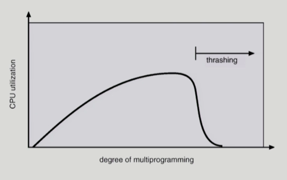

### Virtual Memory

- demand paging
  
  - 실제로 필요할 때 page를 메모리에 올리는 것
    
    - I/O 양의 감소
    
    - memory 사용량 감소
    
    - 빠른 응답 시간
    
    - 더 많은 사용자 수용
  
  - valid / invalid bit 사용
    
    - invalid
      
      - 사용되지 않는 주소 영역인 경우
      
      - 페이지가 물리적 메모리에 없는 경우
    
    - 처음에는 모든 page entry가 invalid로 초기화
    
    - address translation 시에 invalid bit로 set되어 있으면 **page fault**
      
      - 요청한 페이지가 메모리에 없는 경우
      
      - page fault
        
        - invalid page를 접근하면 MMU가 trap을 발생시킴 (page fault trap)
          
          - CPU가 운영체제한테 자동으로 넘어감
        
        - kernel mode로 들어가서 page fault handler가 invoke 됨
        
        - 아래의 순서로 page fault 처리
          
          - 잘못된 요청인지 확인 (bad address, protection violation 등)
            
            - 프로세스 중단
          
          - 빈 페이지 프레임을 가져옴
            
            - 페이지를 디스크에서 메모리로 올려줘야 함
            
            - 메모리가 가득 찬 경우 기존의 페이지에서 뺏어옴
          
          - 해당 페이지를 disk에서 memory로 읽어옴
            
            - disk I/O가 끝나기까지 이 프로세스는 CPU를 preempt 당함 (block)
            
            - disk read가 끝나면 page tables entry 기록, valid/invalid bit을 valid로
            
            - ready queue에 process를 insert -> dispatch later
          
          - 이 프로세스가 CPU를 잡고 다시 running
          
          - 아까 중단되었던 instruction을 재개
  
  - performance of demand paging
    
    - page fault rate에 따라 크게 좌우됨
    
    - page fault rate p, 0 <= p <= 1
      
      - p = 0이면 page fault 없음
      
      - p = 1이면, 메모리 참조할 때마다 page fault 발생
      
      - 실제로는 거의 0에 가까운 값으로 나옴
    
    - effective access time
      
      - (1 - p) * memory access + p * (OS & HW page fault overhead + [swap page out if needed] + swap page in + OS & HW restart overhead)
        
        - page fault가 발생하면 엄청난 시간이 소요됨

- Replacement Algorithm
  
  - page replacement
    
    - free frame이 없는 경우 어떤 프레임을 빼앗아올지 정해야 함
      
      - OS의 역할
    
    - 곧바로 사용되지 않을 page를 쫓아내는 것이 좋음
    
    - 동일한 페이지가 여러 번 메모리에서 쫓겨났다가 다시 들어올 수 있음
  
  - replacement algorithm
    
    - page-fault rate을 최소화하는 것이 목표
    
    - 알고리즘의 평가
      
      - 주어진 page reference string에 대해 page fault를 얼마나 내는지 조사
  
  - optimal algorithm
    
    - 가장 먼 미래에 참조되는 page를 replace
    
    - 미래의 참조를 현실적으로 알 수는 없기 때문에 offline algorithm이라고 불림
      
      - 다른 알고리즘의 성능에 대한 upper bound 제공
        
        - Belady's optimal algorithm, MIN, OPT 등으로 불림
  
  - FIFO (First In First Out) algorithm
    
    - 먼저 들어온 페이지를 먼저 내쫓음
    
    - FIFO Anomaly (Belady's Anomaly)
      
      - 메모리 크기를 늘리는데 page fault 수가 더 늘어나 성능이 더 나빠지는 경우가 발생하기도 함
  
  - LRU (Least Recently Used) algorithm
    
    - 가장 오래 전에 참조된 것을 지움
    
    - linked-list 형태
      
      - O(1) complexity
  
  - LFU (Least Frequently Used) algorithm
    
    - 참조 횟수(reference count)가 가장 적은 페이지를 지움
      
      - 참조 횟수가 가장 적은 페이지가 여러 개인 경우
        
        - LFU 알고리즘 자체에서는 여러 page 중 임의로 선정
        
        - 성능 향상을 위해 가장 오래 전에 참조된 page를 지우게 구현할 수도 있음
      
      - 장단점
        
        - LRU처럼 직전 참조 시점만 보는 것이 아니라 장기적인 시간 규모를 보기 때문에 page의 인기도를 좀 더 정확히 반영할 수 있음
        
        - 참조 시점의 최근성을 반영하지 못함
        
        - LRU보다 구현이 복잡함
    
    - heap 형태
      
      - O(log n) complexity
  
  - Clock algorithm
    
    - Clock algorithm (= second chance algorithm, NUR(Not Used Recently), NRU(Not Recently Used))
      
      - LRU의 근사 (approximation) 알고리즘
      
      - reference bit을 사용해서 교체 대상 페이지 선정 (circular list)
      
      - reference bit가 0인 것을 찾을 때까지 포인터를 하나씩 앞으로 이동
      
      - 포인터를 이동하는 중에 reference bit 1은 모두 0으로 바꿈
      
      - reference bit이 0인 것을 찾으면 그 페이지를 교체
      
      - 한 바퀴 되돌아와서도 (=second chance) 0이면 그때에는 replace 당함
      
      - 자주 사용되는 페이지라면 second chance가 올 때 1
    
    - Clock algorithm의 개선
      
      - reference bit과 modified bit (dirty bit)을 함께 사용
      
      - 최근에 참조된 페이지의 reference bit은 1
      
      - 최근에 변경된 페이지 (I/O를 동반하는 페이지)의 modified bit은 1

- 다양한 캐슁 환경
  
  - 캐슁(caching) 기법
    
    - 한정된 빠른 저장 공간을 가지고 계속적으로 요청되는 새로운 객체를 저장 공간에 읽어들였다가 후속 요청 시 직접 서비스하는 방식
      
      - 해당 저장 공간을 캐쉬라고 함
    
    - paging system 외에도 cache memory, buffer caching, web caching 등 다양한 분야에서 사용
  
  - 캐쉬 운영의 시간 제약
    
    - 교체 알고리즘에서 삭제할 객체를 결정하는 일에 지나치게 많은 시간이 걸리는 경우 실제 시스템에서 사용할 수 없음
    
    - buffer caching이나 web caching의 경우
      
      - O(1)에서 O(log n) 정도까지 허용
        
        - LRU, LFU 사용 가능
    
    - paging system인 경우
      
      - 페이지 요청이 너무 빈번하여 O(1)인 LRU 알고리즘의 list 조작도 부담
        
        - paging system에서 LRU, LFU를 사용하기 어려움
        
        - **Clock algorithm** 사용

- page frame의 allocation
  
  - 각 process에 얼만큼의 page frame을 할당할 것인지
  
  - allocation의 필요성
    
    - 메모리 참조 명령어 수행시 명령어, 데이터 등 여러 페이지 동시 참조
      
      - 명령어 수행을 위해 최소한 할당되어야 하는 frame의 수가 있음
    
    - loop를 구성하는 page는 한번에 allocate되는 것이 유리함
      
      - 최소한의 allocation이 없으면 매 loop마다 page fault 발생
  
  - allocation scheme
    
    - equal allocation
      
      - 모든 프로세스에 똑같은 개수 할당
    
    - proportional allocation
      
      - 프로세스 크기에 비례하여 할당
    
    - priority allocation
      
      - 프로세스의 priority에 따라 다르게 할당

- global replacement vs local replacement
  
  - global replacement
    
    - replace 시 다른 process에 할당된 frame을 빼앗아 올 수 있음
    
    - process별 할당량을 조절하는 또 다른 방법
    
    - 예시
      
      - FIFO, LRU, LFU 등의 알고리즘을 global replacement로 사용시
      
      - Working set, PFF 알고리즘 사용시
  
  - local replacement
    
    - 자신에게 할당된 frame 내에서만 replacement
    
    - FIFO, LRU, LFU 등의 알고리즘을 process 별로 운영시

- thrashing
  
  - thrashing
    
    - 프로세스의 원활한 수행에 필요한 최소한의 page frame 수를 할당받지 못한 경우 발생
    
    - page fault rate이 매우 높아짐
    
    - CPU utilization이 낮아짐
    
    - OS는 MPD (Multiprogramming degree)를 높여야 한다고 판단
    
    - 또 다른 프로세스가 시스템에 추가됨 (higher MPD)
    
    - 프로세스 당 할당된 frame의 수가 더욱 감소
    
    - 프로세스는 page의 swap in / swap out으로 매우 바쁨
    
    - 대부분의 시간에 CPU는 한가함
    
    - low throughput
  
  - thrashing diagram
    
    

- working-set
  
  - working-set model
    
    - locality of reference
      
      - 프로세스는 특정 시간 동안 일정 장소만을 집중적으로 참조
      
      - 집중적으로 참조되는 해당 page 집합을 locality set이라 함
    
    - working-set model
      
      - working-set
        
        - locality에 기반하여 프로세스가 일정 시간동안 원활하게 수행되기 위해 한꺼번에 메모리에 올라와 있어야 하는 page의 집합
      
      - working-set 모델에서는 process의 working-set 전체가 메모리에 올라와 있어야 수행되고 그렇지 않을 경우 모든 frame을 반납한 후 swap out (suspend)
      
      - thrashing을 방지함
      
      - multiprogramming degree 결정
  
  - working-set algorithm
    
    - working set의 결정
      
      - working set window를 통해 알아냄
      
      - window size가 Δ인 경우
        
        - 시각 ti에서의 working set WS(ti)
          
          - time interval [ti-Δ, ti] 사이에 참조된 서로 다른 페이지들의 집합
        
        - working set에 속한 page는 메모리에 유지, 속하지 않은 것은 버림 (즉, 참조된 후 Δ시간 동안 해당 page를 메모리에 유지한 후 버림)
    
    - working set algorithm
      
      - process의 working set size 합이 page frame의 수보다 큰 경우
        
        - 일부 process를 swap out시켜 남은 process의 working set을 우선적으로 충족시킴 (MPD를 줄임)
        
        - working set을 다 할당하고도 page frame이 남는 경우
          
          - swap out 되었던 프로세스에게 working set을 할당 (MPD를 키움)
    
    - window size Δ
      
      - working set을 제대로 탐지하기 위해서는 window size를 잘 결정해야 함
      
      - Δ값이 너무 작으면 locality set을 모두 수용하지 못할 우려가 있음
      
      - Δ값이 너무 크면 여러 규모의 locality set 수용
      
      - Δ값이 ∞이면 전체 프로그램을 구성하는 page를 working set으로 간주